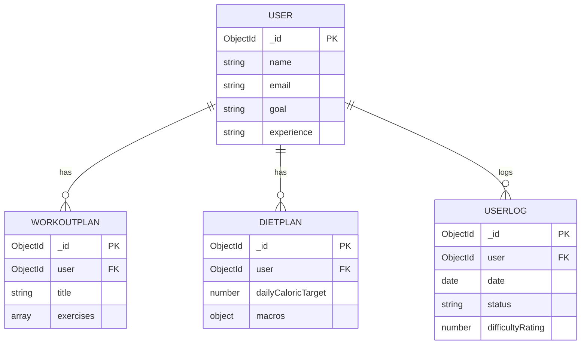

npm start

Backend/
├── config/
│   └── db.js                 # Handles the MongoDB database connection logic.
├── controllers/
│   ├── authController.js     # Logic for user signup, login, and token refresh.
│   ├── chatController.js     # Logic to handle chatbot interactions.
│   ├── dietController.js     # Logic for BMR/TDEE and nutrition calculations.
│   ├── dietPlanController.js # CRUD operations for user diet plans.
│   ├── logController.js      # CRUD operations for user's daily logs.
│   └── workoutController.js  # CRUD and adaptive logic for workout plans.
├── middleware/
│   └── authMiddleware.js     # Protects routes by validating JWT tokens.
├── models/
│   ├── DietPlan.js           # Mongoose schema for diet plans.
│   ├── User.js               # Mongoose schema for users.
│   ├── UserLog.js            # Mongoose schema for daily user logs.
│   └── WorkoutPlan.js        # Mongoose schema for workout plans.
├── routes/
│   ├── authRoutes.js         # Defines /api/auth endpoints (signup, login).
│   ├── chatRoutes.js         # Defines /api/chat endpoint.
│   ├── dietPlanRoutes.js     # Defines /api/diet-plan endpoints.
│   ├── dietRoutes.js         # Defines /api/diet endpoints (e.g., /calculate).
│   ├── logRoutes.js          # Defines /api/logs endpoints.
│   └── workoutRoutes.js      # Defines /api/workouts endpoints.
├── services/
│   └── decisionTreeService.js # Contains complex business logic (e.g., workout adjustment AI).
├── .env                      # Stores secret environment variables (DB URI, JWT secrets).
├── package.json              # Lists project dependencies and scripts.
├── server.js                 # The main entry point for the backend server.
├── Backend_Ritisha.md        # The main technical documentation.
├── README_PRITAM.md          # Documentation from Pritam.
├── README_shreya.md          # Documentation from Shreya.
└── Readme_Subh.md            # Documentation from Subham.

# Technical Documentation: Personalized Gym Assistant Backend

---

## Chapter 1: Introduction & System Overview

### 1.1 Project Goal
The Personalized Gym Assistant is an intelligent digital ecosystem designed to democratize access to personalized fitness coaching. The backend serves as the central nervous system, providing a robust API for the frontend application and orchestrating communication with the AI/ML intelligence layer. It manages user data, authentication, and the generation of dynamic workout and nutrition plans.

### 1.2 Backend Architecture
The backend is built upon a classic **Model-View-Controller (MVC)** architecture to ensure a clean separation of concerns, modularity, and scalability.

-   **Models:** Define the database schemas (e.g., `User`, `WorkoutPlan`) and interact with the MongoDB database via the Mongoose ODM.
-   **Controllers:** Contain the core business logic. They process incoming requests, interact with the models to perform database operations, and formulate responses.
-   **Routes:** Define the API endpoints and map them to specific controller functions. They act as the entry point for all client requests.

This structure is orchestrated by a central `server.js` file, which initializes the Express.js application, establishes a database connection, and mounts the various route modules.

### 1.3 Technology Stack

| Technology      | Role                               |
| --------------- | ---------------------------------- |
| **Node.js**     | JavaScript Runtime Environment     |
| **Express.js**  | Web Application Framework          |
| **MongoDB**     | NoSQL Document-Oriented Database   |
| **Mongoose**    | Object Data Modeling (ODM) for MongoDB |
| **jsonwebtoken**| JWT-based Authentication           |
| **bcryptjs**    | Password Hashing                   |
| **dotenv**      | Environment Variable Management    |
| **cors**        | Cross-Origin Resource Sharing      |
| **Nodemon**     | Development Server Auto-Restart    |

---

## Chapter 2: API Design & Endpoints

The backend exposes a RESTful API with a base path of `/api`. All endpoints are designed to be stateless and follow standard HTTP conventions.

### 2.1 Authentication Endpoints
**Base Path:** `/api/auth`
-   `POST /signup`: Registers a new user.
-   `POST /login`: Authenticates an existing user and returns access and refresh tokens.
-   `POST /refresh-token`: Generates a new access token using a valid refresh token.

### 2.2 Workout Endpoints
**Base Path:** `/api/workouts` (Protected)
-   `POST /`: Creates a new workout plan for the authenticated user.
-   `GET /user`: Retrieves all workout plans for the authenticated user.
-   `PUT /:planId`: Updates a specific workout plan.
-   `DELETE /:planId`: Deletes a specific workout plan.
-   `POST /adjust`: Triggers the weekly plan adjustment logic based on recent user logs.

### 2.3 User Log Endpoints
**Base Path:** `/api/logs` (Protected)
-   `POST /`: Creates a new daily log for the authenticated user.
-   `GET /`: Retrieves all logs for the authenticated user.
-   `PUT /:logId`: Updates a specific log entry.
-   `DELETE /:logId`: Deletes a specific log entry.

### 2.4 Diet & Nutrition Endpoints
**Base Path:** `/api/diet`, `/api/diet-plan` (Protected)
-   `GET /diet/calculate`: Calculates user's BMR and TDEE based on their profile.
-   (Other diet plan CRUD endpoints are defined under `/api/diet-plan`).

### 2.5 Chatbot Endpoint
**Base Path:** `/api/chat` (Protected)
-   `POST /`: Forwards user queries to the Python-based NLP intelligence layer for processing.

---

## Chapter 3: Core Backend Modules

### 3.1 Authentication and Authorization
Security is managed via JSON Web Tokens (JWT).

1.  **Registration & Login:** Upon successful login, the `authController` generates two tokens:
    *   **Access Token:** A short-lived (15m) token used to authorize access to protected API routes.
    *   **Refresh Token:** A long-lived (7d) token used to obtain a new access token without requiring the user to log in again. This token is stored in the user's document in the database for validation.
2.  **Password Security:** User passwords are never stored in plaintext. They are hashed using `bcryptjs` with a salt factor of 10 before being saved to the database.
3.  **Protected Routes:** An `authMiddleware` is used to protect sensitive endpoints. This middleware validates the `Authorization: Bearer <token>` header on incoming requests. If the token is valid, it decodes the user ID and attaches it to the request object (`req.user`), making it available to downstream controllers.

### 3.2 Workout Management
Handled by `workoutController.js`, this module manages the full lifecycle of a user's workout plan.

-   **CRUD Operations:** Provides standard create, read, update, and delete functionality for workout plans, ensuring that all operations are scoped to the authenticated user.
-   **Adaptive Plan Adjustment:** The `weeklyPlanAdjustment` function is a key feature. It fetches the user's logs from the past 7 days and analyzes metrics like missed days, injury reports, and average workout difficulty. This data is fed into a `decisionTreeService` which returns an adjustment object (e.g., `{ volumeMultiplier: 1.1, notes: "Increased volume due to low difficulty." }`). The controller then applies these adjustments to the user's current workout plan.

### 3.3 Diet and Nutrition Engine
This module, primarily documented by Subham, calculates personalized nutritional targets.

-   **BMR & TDEE Calculation:** It uses the **Harris-Benedict Equation** to determine the user's Basal Metabolic Rate (BMR) based on their profile (age, weight, height, gender). This is then used to calculate the Total Daily Energy Expenditure (TDEE) by factoring in their activity level.
-   **Macronutrient Calculation:** Based on the user's goal (e.g., Muscle Gain, Fat Loss), a calorie surplus or deficit is applied to the TDEE. From this target, macronutrient goals (Protein, Carbohydrates, Fats) are calculated and provided to the user.

### 3.4 AI & Orchestration Layer
As documented by Pritam, the Node.js backend acts as an orchestrator for the Python-based intelligence layer.

-   **Node-Python Communication:** The backend uses `axios` to make HTTP requests to a separate Flask microservice. This is used for features like the NLP-powered chatbot (`/api/chat`).
-   **Adaptive Intelligence:** The backend facilitates the adaptive feedback loop by collecting user difficulty ratings via the `logController` and using that data in the `workoutController`'s adjustment logic.

---

## Chapter 4: Database Design

### 4.1 Overview
The application utilizes MongoDB, a NoSQL document-oriented database, to handle the flexible and evolving nature of user data and AI-generated plans. This choice allows for rapid iteration of schema structures, particularly for nested workout routines and nutritional data. Relationships are maintained via `ObjectId` references, creating a relational structure within the document store that is enforced at the application level.

### 4.2 Schema Definitions

#### 1. User Collection (`users`)
The core entity storing authentication credentials, physical attributes, and personalization constraints.

```javascript
{
  _id: ObjectId,
  name: { type: String, required: true },
  email: { type: String, required: true, unique: true },
  password: { type: String, required: true },
  age: Number,
  weight: Number, // in kg
  height: Number, // in cm
  gender: String, // Enum: 'Male', 'Female', 'Other'
  goal: String, // e.g., 'Muscle Gain', 'Weight Loss'
  injury: String,
  experience: String, // Enum: 'Beginner', 'Intermediate', 'Advanced'
  dietType: String,
  noOnion: Boolean,
  noGarlic: Boolean,
  refreshToken: String,
  createdAt: Date
}
```

#### 2. Workout Plan Collection (`workoutplans`)
Stores the personalized workout routines generated by the system.

```javascript
{
  _id: ObjectId,
  user: { type: ObjectId, ref: 'User', required: true },
  title: String,
  goal: String,
  experienceLevel: String,
  duration: Number, // in weeks
  daysPerWeek: Number,
  exercises: [{
    name: String,
    sets: Number,
    reps: String, // e.g., '8-12'
    restSeconds: Number
  }],
  notes: String,
  createdAt: Date
}
```

#### 3. Diet Plan Collection (`dietplans`)
Stores nutritional guidelines and meal plans tailored to the user's caloric needs.

```javascript
{
  _id: ObjectId,
  user: { type: ObjectId, ref: 'User', required: true },
  dailyCaloricTarget: Number,
  macros: {
    protein: Number, // in grams
    carbs: Number,   // in grams
    fats: Number     // in grams
  },
  meals: [{
    type: String, // e.g., 'Breakfast', 'Lunch'
    suggestions: [String],
    calories: Number
  }],
  createdAt: Date
}
```

#### 4. User Log Collection (`userlogs`)
Tracks the user's daily activities and feedback to inform the adaptive AI model.

```javascript
{
  _id: ObjectId,
  user: { type: ObjectId, ref: 'User', required: true },
  date: { type: Date, default: Date.now },
  status: String, // Enum: 'active', 'missed', 'injured', 'sick'
  difficultyRating: Number, // Scale of 1-10
  notes: String
}
```

### 4.3 Entity-Relationship Diagram (ERD)
The following diagram illustrates the logical relationships between the MongoDB collections.



### 4.4 Indexing Strategy
To optimize query performance, the following indexes are critical:

-   **users:** A unique index on the `email` field to ensure no duplicate accounts and to speed up login lookups.
-   **workoutplans, dietplans, userlogs:** An index on the `user` field (`userId`) to quickly retrieve all documents related to a specific user.
-   **userlogs:** A compound index on `user` and `date` to efficiently query a user's history for progress tracking and plan adjustments.

---

## Chapter 5: Server Configuration & Deployment

### 5.1 Environment Configuration
The application uses a `.env` file to manage environment-specific variables, loaded at runtime by the `dotenv` package.

-   `PORT`: The port on which the Express server will run (defaults to 5000).
-   `MONGO_URI`: The connection string for the MongoDB Atlas database.
-   `JWT_SECRET`: A long, random, secret string for signing access tokens.
-   `JWT_REFRESH_SECRET`: A separate secret for signing refresh tokens.

### 5.2 Server Entry Point
The `server.js` file is the application's entry point. Its responsibilities include:
1.  Loading environment variables from `.env`.
2.  Calling `connectDB()` to establish the MongoDB connection.
3.  Initializing the Express app.
4.  Applying essential middleware: `cors()` for cross-origin requests and `express.json()` for parsing JSON request bodies.
5.  Mounting all modular route handlers (e.g., `app.use('/api/auth', authRoutes)`).
6.  Starting the server to listen for requests on the configured `PORT`.

### 5.3 Development Workflow
The project is configured to use `nodemon` for the development environment. The `npm run dev` script starts the server with `nodemon`, which automatically monitors for file changes and restarts the server, significantly speeding up the development cycle.